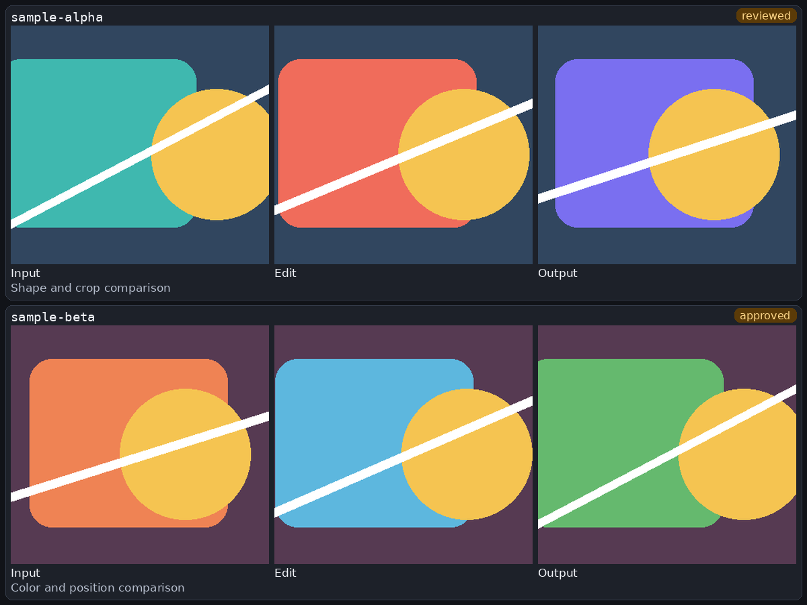
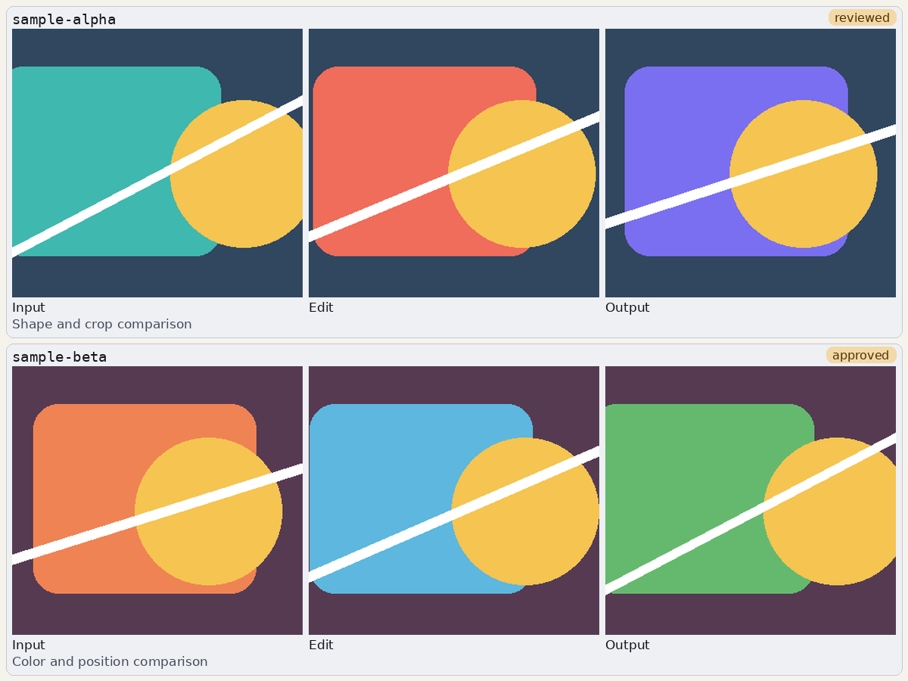

# herdr-image

`herdr-image` shows local images in a reusable Herdr side pane. The rail renders through the Kitty graphics protocol, follows new images without typing into an existing pane, and can compose comparison grids at the pane's exact pixel size.





## Requirements

- [Herdr](https://github.com/ducaale/herdr) with Kitty graphics enabled
- A Kitty-graphics terminal such as WezTerm, Ghostty, or kitty
- Bash, `jq`, and `chafa`. Kitty's `kitten` command is a fallback renderer
- Python 3 with [Pillow](https://python-pillow.org/)
- macOS only: [Peekaboo](https://github.com/steipete/Peekaboo) for `image shot`

Add this to the Herdr config:

```toml
[experimental]
kitty_graphics = true
```

Herdr reads this setting in the client. Close and reopen Herdr after changing it. Reloading the config is not enough.

## Install

Clone this repository, then run:

```bash
cd herdr-image
./install.sh
```

The installer creates these links:

```text
~/.local/bin/image
~/.local/bin/agent-shot
~/.local/share/zsh/site-functions/_image
```

Keep the checkout in place. The command resolves its real path through the installed symlink and loads the scripts from this repository. Add `~/.local/bin` to `PATH` if it is not there already. Zsh users may need `autoload -Uz compinit && compinit` once after installation.

To make the included skill available to Claude Code:

```bash
mkdir -p ~/.claude/skills
ln -s "$PWD/skills/show-image" ~/.claude/skills/show-image
```

Other skill-aware agents can point their skill directory at [`skills/show-image`](skills/show-image).

## Show images

Run commands from the Herdr pane that should own the image rail.

```bash
image ./chart.png
image ./chart.png "Signups by week"
image -s ./chart.png              # 100% natural size
image -m ./chart.png              # fit the rail, the default
image -l ./chart.png              # 200% natural size
image --zoom 150 ./chart.png
image ls
image last
```

The first image opens one side pane. Later images reuse it without sending pane input. Images are copied into `~/.cache/agent-images`, so deleting or replacing the source cannot change an image already queued for display.

## Build grids

Pass paths directly for a simple grid:

```bash
image grid before.png after.png --cols 2
image grid first.png second.png third.png --labels "Input,Edit,Result"
```

Use a manifest when each row has its own title, note, or badge:

```json
[
  {
    "row_id": "portrait-01",
    "badge": "approved",
    "note": "Compare the crop and color balance.",
    "cells": [
      {"path": "images/portrait-01-before.png", "label": "Before"},
      {"path": "images/portrait-01-after.png", "label": "After"}
    ]
  }
]
```

```bash
image grid --manifest comparisons.json
```

The manifest must be a non-empty JSON array. Every row needs a non-empty `cells` array. Every cell needs a string `path`; relative paths resolve from the manifest directory. `label`, `row_id`, `note`, and `badge` are optional strings.

For repeated naming schemes, use one brace group. The command groups files by the text outside the brace values and keeps only complete rows.

```bash
image grid \
  --pattern 'runs/*/{before,after}.png' \
  --labels 'Before,After'
```

The pattern must contain exactly one `{a,b,...}` group. Labels must match the brace values in count and order. Quote the pattern so the shell does not expand it first.

Add `--dense` to any grid form to remove labels, row titles, notes, and badges. Dense mode uses the whole page as an image wall.

```bash
image grid --manifest comparisons.json --dense
```

Large grids page automatically. The rail composes each page at the current pane dimensions.

## Capture the screen on macOS

```bash
image shot
image shot "Current application state"
```

Peekaboo must have Screen Recording permission. The command checks capture provenance and refuses wallpaper-only or invalid captures. If the calling shell cannot inherit the permission, `agent-shot` retries through WezTerm and uses WezTerm's Screen Recording grant.

## Rail keys

| Key | Action |
|---|---|
| `n` | Next image or grid page |
| `p` | Previous image or grid page |
| `r` | Redraw at the current pane size |
| `q` | Close the rail |

## Safety model

The command only sends input to a pane created by its immediately preceding Herdr split. It proves that the new pane reached a shell prompt before starting the watcher. Reuse performs only a cache write. A recorded pane is accepted only when its live process contains the expected watcher path and ownership token. Herdr calls, watcher startup, terminal queries, and grid composition all have deadlines.

Cache and ownership paths must be private, regular files owned by the current user. Grid sources are copied without following symlinks. Grid sizes, decoded pixels, JSON bytes, row counts, cell counts, and text lengths are bounded.

## Troubleshooting

| Symptom | Fix |
|---|---|
| The rail is black | Enable `[experimental] kitty_graphics = true`, check that the Herdr TOML parses, then fully reopen Herdr. A duplicate or invalid config key makes Herdr fall back to defaults. |
| `no HERDR_PANE_ID` | Run `image` from the Herdr pane that should own the rail. |
| `no renderer` | Install `chafa`, or install kitty so `kitten` is available. `chafa` works best because Herdr panes do not always report pixel dimensions to `kitten icat`. |
| The terminal does not answer the graphics query | Use WezTerm, Ghostty, or kitty and confirm Kitty graphics is enabled in Herdr. |
| Images disappear over `mosh` | `mosh` does not pass Kitty graphics. Use SSH or Herdr remote instead. |
| `image shot` shows a permission error | Grant Screen Recording permission to Peekaboo's calling terminal. For the helper fallback, grant it to WezTerm. |
| Completion does not appear | Make sure `~/.local/share/zsh/site-functions` is in `fpath`, then rerun `compinit`. |

## Tests

```bash
bash tests/test-img.sh
bash tests/test-image-cli.sh
```

The test suite runs on Linux and macOS. The macOS workflow exercises the rail tests with the system Bash 3.2.

## License

MIT
